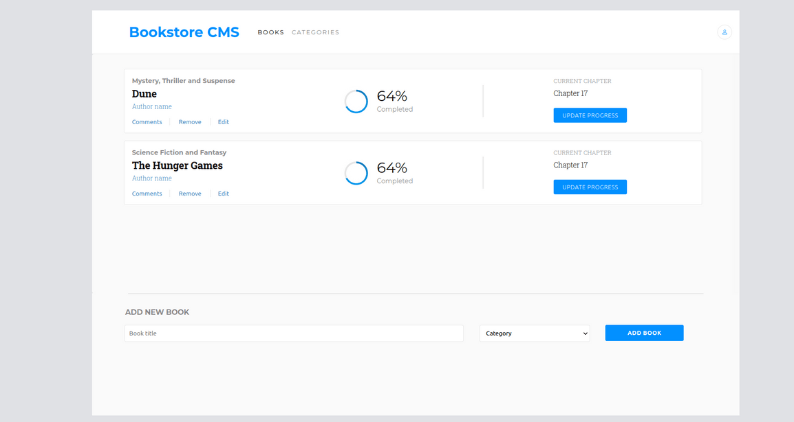

# Bookstore

> "Bookstore" is a website you can add and remove books.

With "Bookstore" and it's API, the books are stored for everybody and ready for later use.

## Live Server

In the following link, you can view the [Bookstore website](https://guerreiropedr0-bookstore.netlify.app).

## Built With

- HTML
- CSS
- JAVASCRIPT
- REACT
- REDUX

## Getting Started

Start by cloning the repository.

`git clone git@github.com:guerreiropedr0/bookstore.git`

Navigate to the created folder.

`cd bookstore`

Install all the dependencies.

`npm install`

Run the live server

`npm run start`

Go to [http://localhost:3000](http://localhost:3000)

Build the distribution folder before hosting the app

`npm run build`

After the build you can host the `build` folder.

## Authors

👤 **Pedro Guerreiro**

- GitHub: [@guerreiropedr0](https://github.com/guerreiropedr0)
- Twitter: [@guerreiropedr0](https://twitter.com/guerreiropedr0)
- LinkedIn: [Pedro Guerreiro](https://www.linkedin.com/in/guerreiropedr0/)

## 🤝 Contributing

Contributions, issues, and feature requests are welcome!

Feel free to check the [issues page](../../issues/).

## Acknowledgments

Thank you Microverse for the opportunity!

## Show your support

Give a ⭐️ if you like this project!

## 📝 License

This project is [MIT](./MIT.md) licensed.
